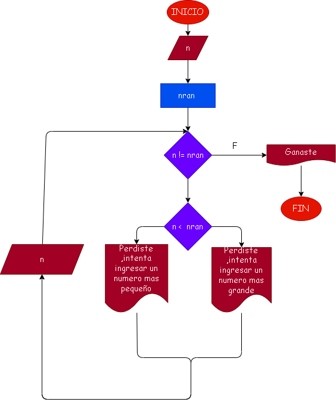

# Adivinar_el_numero

# Analisis
El usuario digitara un numero para luego el programa elija un numero aleatorio con el comando random.randit y adivine si el numero del usuario es menor, mayor o igual 

